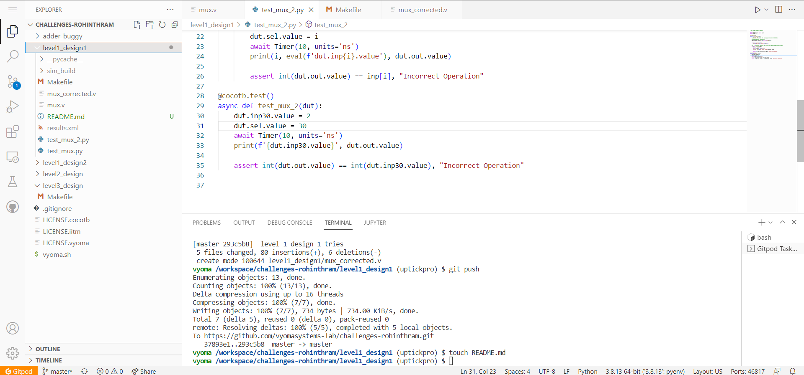
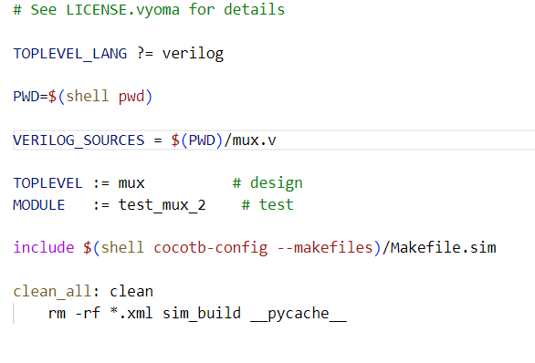
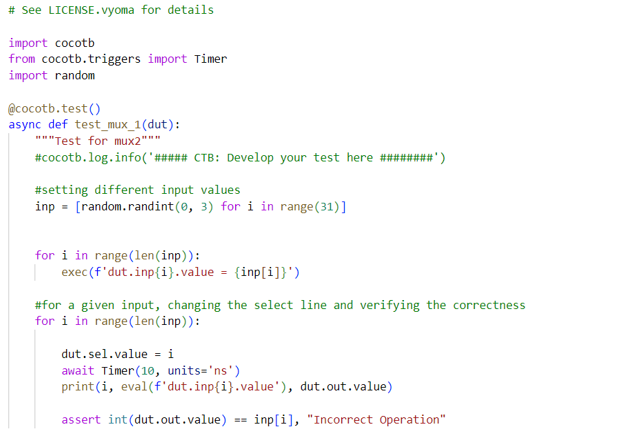

# Design Verification

The verification of design is done using Vyoma's UpTickPro

# Verification using Python

The verification of the design is done using CoCoTb module which is a Co-routine based Co-simulation Testbench for verifying digital design.

The HDL simulator used here is the `icarus-verilog` and the HDL language is `verilog`
The following is a sample make file to run the verification on the Device Under Test(DUT).

Running make command gives the test for the module specified, hence we can verify the correctness of the design by passing various test vectors and checking for proper functionality.

A sample CoCoTb file is as shown

The verification and bug details for the designs are provided in the respective directories as README.md file
- [MUX](/level1_design1/README.md)
- [Sequence Detector](/level1_design2/README.md)
- [Bit Manipulation Co-processor](/level2_design/README.md)
- [Gray to Binary Code Converter using FSM](/level3_design/README.md)

---

# Ack
