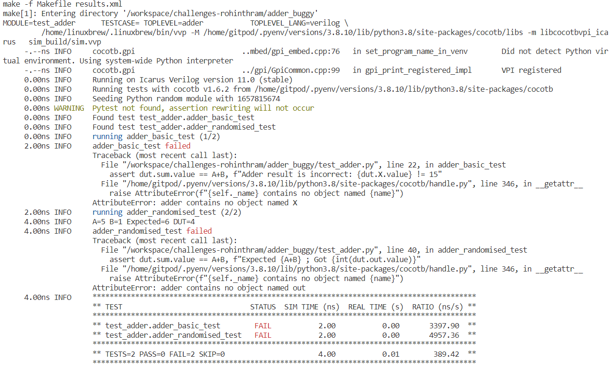
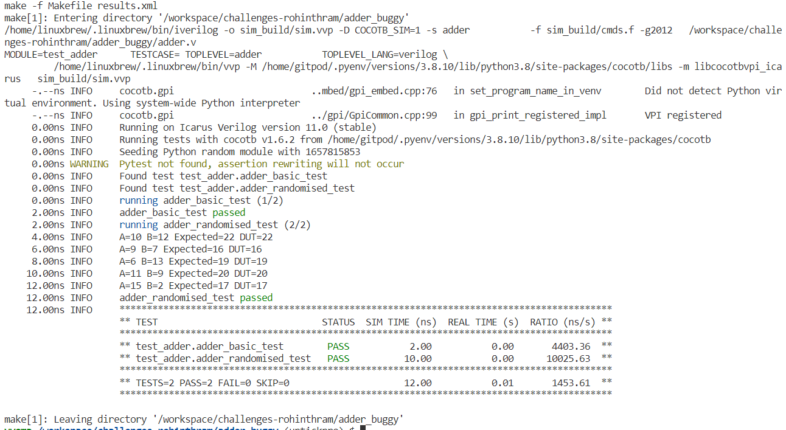

# Probing Full Adder

This page presents the debugging of full adder design using Vyoma's UpTickPro

The tool is actiavted using the following command 

```
$ source vyoma.sh
```

The circuit is tested using the cocotb in python

The test is done by giving inputs to the Design Under Test (adder module here) which takes in 4-bit inputs *a* and *b* and gives 5-bit output *sum*

The values are assigned to the input port using 
```
dut.a.value = 7
dut.b.value = 5
```

The assert statement is used for asserting the correctness of the design
```
assert int(dut.out.value) == 12, f"Expected 12 ; Got {int(dut.out.value)}"
```

This statement will give the incorrect out value in the terminal.
Aditionally, we can use `dut._log_info` as illustrated below
```
dut._log.info(f'A={A} B={B} Expected={A+B} DUT={int(dut.sum.value)}')
```

We can give as many test as needed by defining many functions (asyncronous) with `cocotb.test` decorator as 
```
@cocotb.test()
async def adder_test_1(dut):
    # test code

@cocotb.test()
async def adder_test_2(dut):
    # test code
```

The Makefile is given the verilog file as the top module and module as the design testing python file
```
TOPLEVEL := adder
MODULE := test_adder
```
This will take the `adder` module as the DUT and will run the test specified in `test_adder.py`

Once we have given the necessary test, we can run using `make` command to see the test results


This shows that the two tests have failed, from seeing the expected value and value for DUT we can see that the design has given A-B instead of A+B.

After changing the design file, the test will pass and the test result will be as shown


We have verified the adder design for correct operation!!!

# Report By
-  R.V.Rohinth Ram

# Acknowledments
- Lavanya J, CEO/Founder, Vyoma Systems - lavanya@vyomasystems.com
- Kunal Ghosh, Co-founder, VLSI System Design (VSD) Corp. Pvt. Ltd. - kunalpghosh@gmail.com
