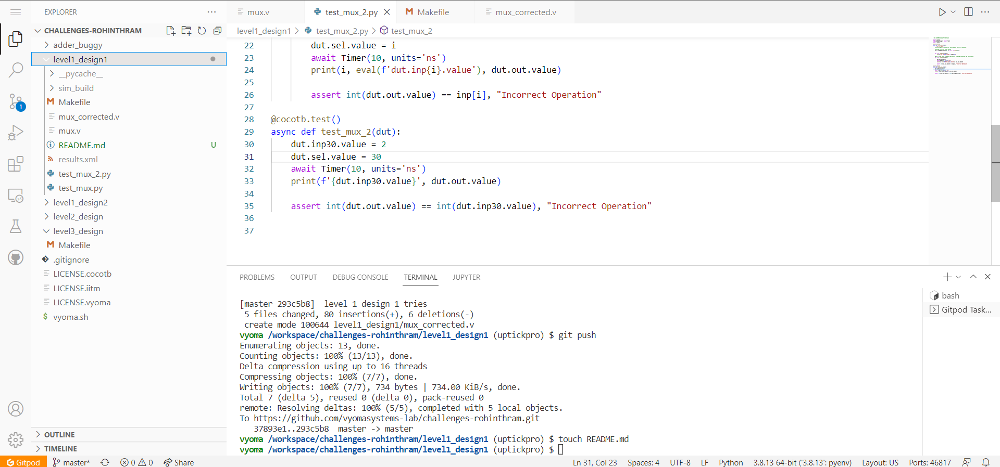
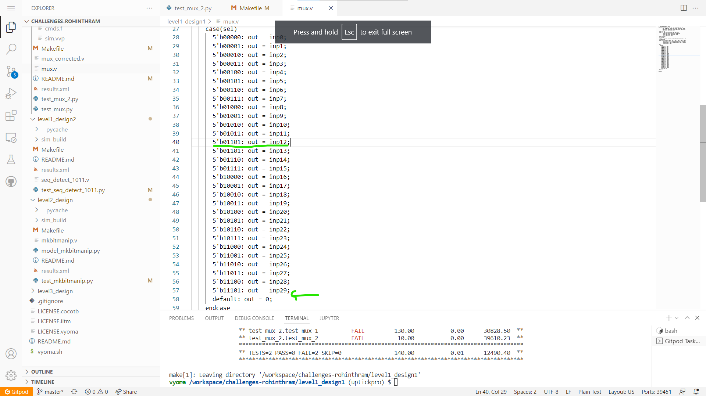
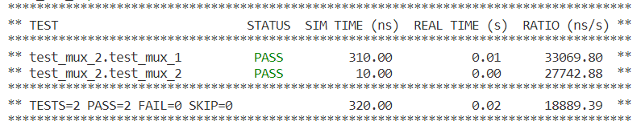

# Multiplexer Design Verification



## Verification Environment
The test drives inputs to the Design Under Test using dut.&lt;input-port-name&gt;.value = &lt;value&gt;

The values are assigned to the input port using 
```
inp = [random.randint(0, 3) for i in range(31)]

for i in range(len(inp)):
    exec(f'dut.inp{i}.value = {inp[i]}')
```

The assert statement is used for comparing the output from the MUX with the expected value.


```
assert int(dut.out.value) == inp[i], "Incorrect Operation"
```

We can log the output from the DUT using `dut._log.info()` 


## Test Scenario 1
- Test Inputs: inp12 = 3, inp13 = 1, others not needed; sel = 12
- Expected Output: 3
- Observed Output in the DUT dut.out=1

## Test Scenario 2
- Test Inputs: inp30 = 3, others not needed; sel = 30
- Expected Output: 3
- Observed Output in the DUT dut.sum=0

Output mismatches for the above inputs proving that there is a design bug

## Bug
Based on the above test input and analysing the design, we see the following



- The case statement for *input 12* is given as *13* as opposed to *12*
- The is no case statement for *input 30* hence output is always zero


## Design Fix
Updating the design and re-running the test makes the test pass.



The updated design is checked in as mux_corrected.v

## Verification Strategy
 Verify all possible select lines keep the input to the input lines (0 to 30) fixed.

## Is the verification complete ?
 Verification is complete, this is a simple design where nearly all possible test cases were able to be simulated. But there may be certain edge cases that may fail.