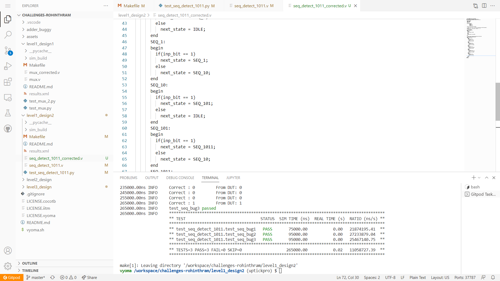
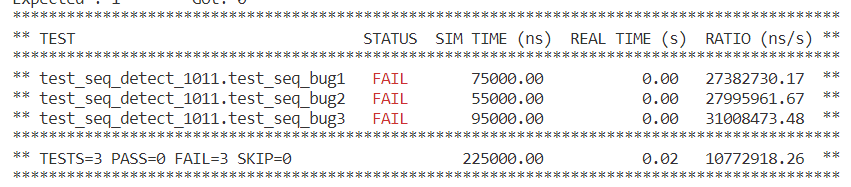
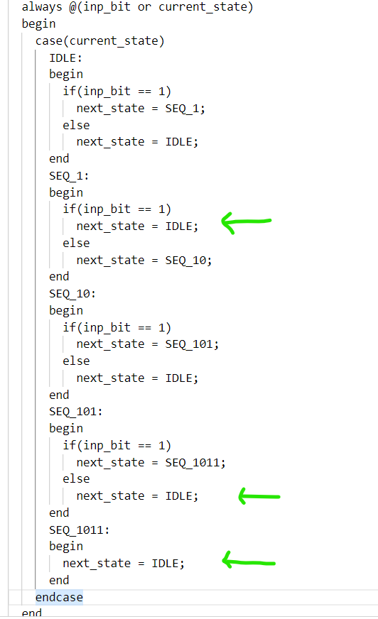
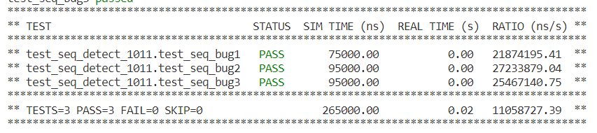

# Sequence Detector Design Verification




## Verification Environment
The test drives inputs to the Design Under Test using dut.&lt;input-port-name&gt;.value = &lt;value&gt;

The sequence detector is a sequencial device, which uses a clock.
In CoCoTb, we simulate clock using
```
from cocotb.clock import Clock

clock = Clock(dut.clk, 10, units="us")  
cocotb.start_soon(clock.start())    
```
Here, *dut.clk* is the input clock port of the DUT, 10us clock is generated. *start_soon* function starts the clock


The awaiting until the edge of the clock is done using *RisingEdge* or  *FallingEdge* function from **cocotb.triggers** as
```
    await RisingEdge(dut.clk)
```

The values are assigned to the input port using (awiting until the clock edge)
```
dut.inp_bit.value = 1
await RisingEdge(dut.clk)
```

The assert statement is used for comparing the output from the sequence detector with the expected value.


```
assert dut.seq_seen == out[i], f"Incorrect Operation\nExpected : {out[i]} \t Got: {dut seq_seen.value}"
```

We can log the output from the DUT using `dut._log.info()` 


## Test Scenario 1
inp = [1,0,1,0,1,1]

out = [0,0,0,0,0,1]

## Test Scenario 2
inp = [1,0,1,1,1,0,1,1]

out = [0,0,0,1,0,0,0,1]

## Test Scenario 3
inp = [0,0,0,1,1,0,1,1]

out = [0,0,0,0,0,0,0,1]

Output mismatches for the above inputs showing that there is a design bug



## Bug
Based on the above test input and analysing the design, we see the following



- The next state for SEQ_1 for 1 input should be SEQ_1 instead of IDLE

- The next state for SEQ_101 for 0 input should be SEQ_10 instead of IDLE

- For SEQ_1011 state, we add state transition to SEQ_1 for 1 input

## Design Fix
Updating the design and re-running the test makes the test pass.



The updated design is checked in as mux_corrected.v

## Verification Strategy
Randomly assign and verify the logic given, check if the design functions as per the design specifications. For example, try 1011 , it gives correct output, now add some more bits 
try 11011, which shows one bug
next try 1101011 which points yet another bug. In the same way we can capture the bug.

## Is the verification complete ?
 Verification is complete, many test cases have been simulated. But there may be certain edge cases that may fail.