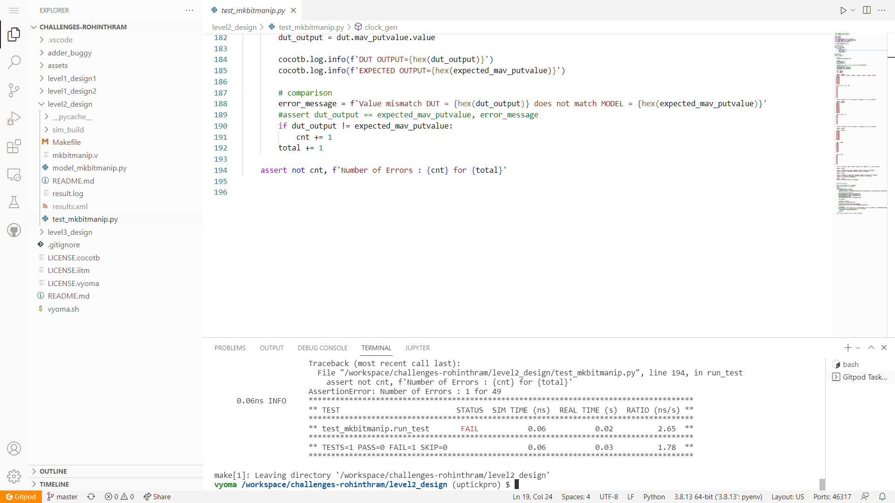
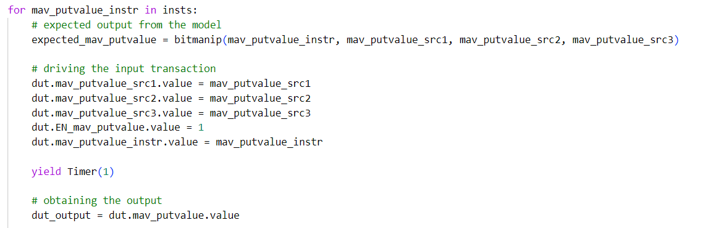
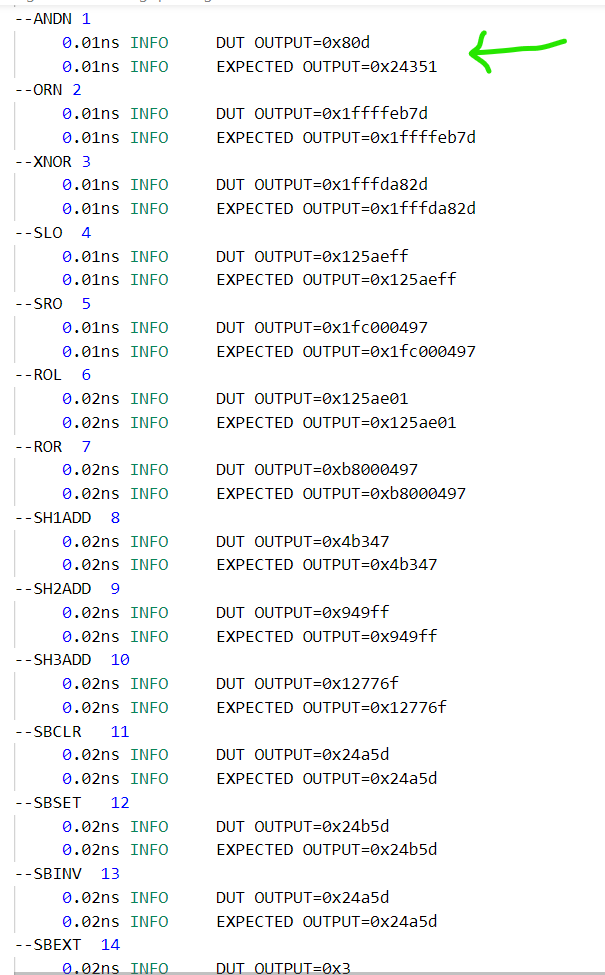
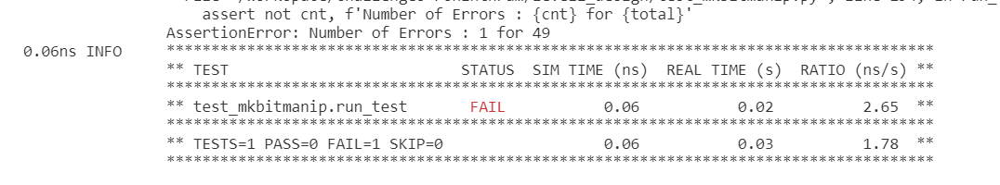

# Bit Manipulator Co-processor Design Verification



## Verification Environment
Various instructions from the instruction set are first made into a list, and each instruction from the list it tested one by one. For example,  

```
ins_str = [func7[i] + rs2 + rs1 + func3[i] + rd + opcode for i in range(len(func7))]
```

The functioning of the Bit Manipulator is provided by the *model_mkbitmanip.py*. The below function call provides the correct functioning of the processor(taken for granted)

```
bitmanip(mav_putvalue_instr, mav_putvalue_src1, mav_putvalue_src2, mav_putvalue_src3)
```

The values to the input are taken as 
```
mav_putvalue_src1 = 0x000125ae
mav_putvalue_src2 = 0x00000e47
mav_putvalue_src3 = 0x00000000
```

The testbench drives inputs to the Design Under Test using dut.&lt;input-port-name&gt;.value = &lt;value&gt;

The values are assigned to the input port, testing all possible instructions



The assert statement is used for comparing the output from the Bit Manipulator processor with the expected value. Here, the number of incorrect outputs is kept track of. This asserts that there is no error in the execution of the complete instruction set.

```
assert not cnt, f'Number of Errors : {cnt} for {total}'

```

## Test Scenario
Here, all the instructions are tested for correctness. From the result of **make**, we conclude that the processor has bug 


## Bug
Based on log results from the verification setup, we see the following




- The `ANDN 1` instrucution fails

The complete log of instrcutions can be found in **result.log**

## Verification Strategy
 Change the input and instruction to test the processor's functionality. Here the behaviour of the processor is mimicked by the *bitmanip()* from *model_mkbitmanip.py*, which we assume is correct

## Is the verification complete ?
 Verification is complete, but there may be a lot of edge cases for this processor. This is a complex design with a ton of different instructions (32 bit). The functionality may work for a given test vector but fail for the same instruction with a different test vector.