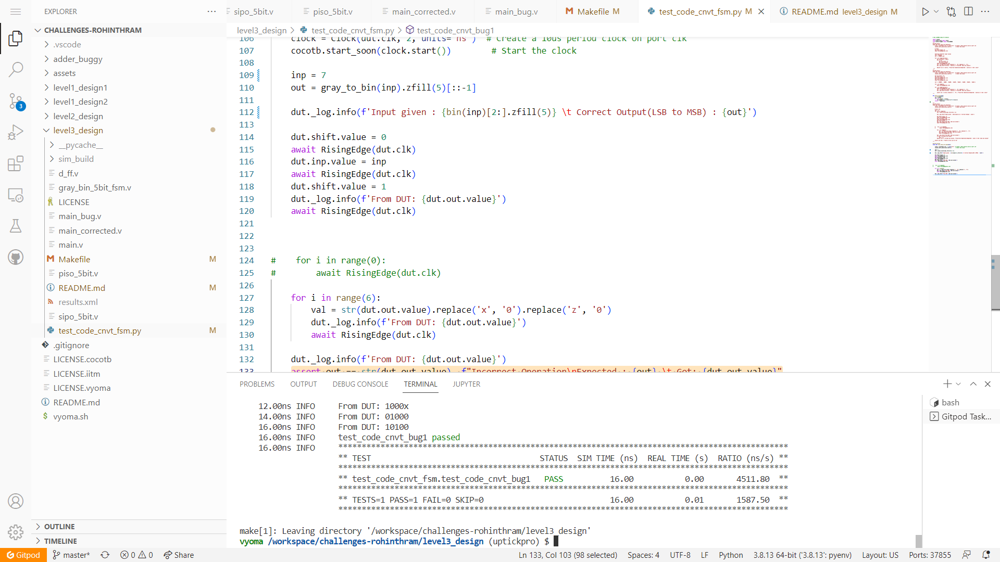
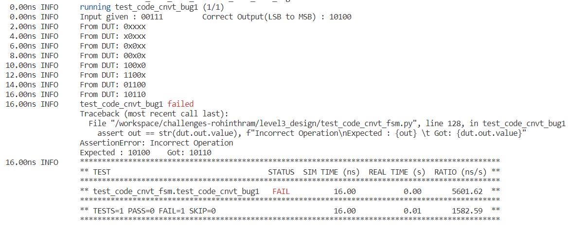
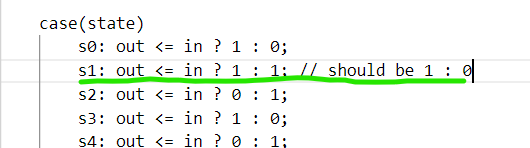
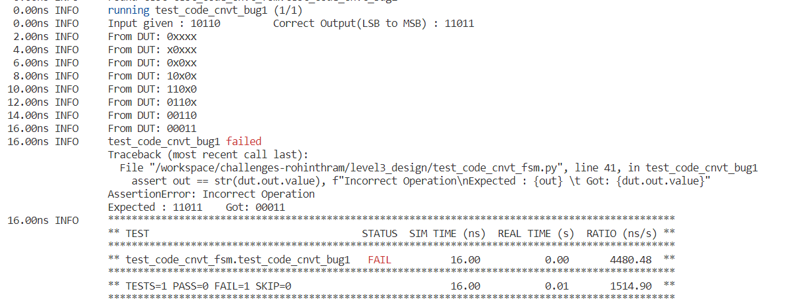
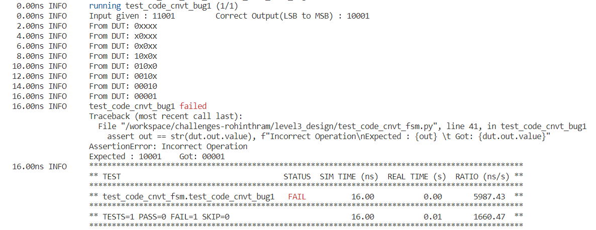
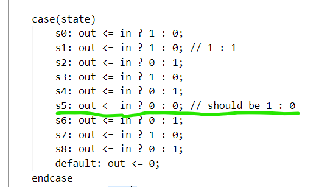
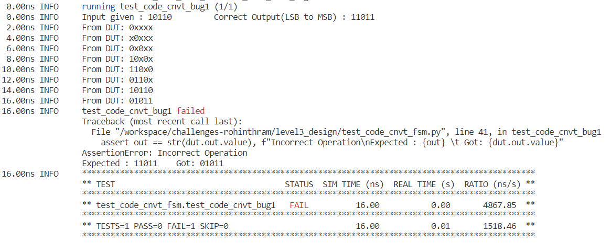
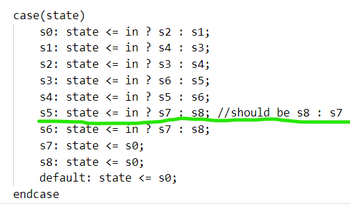
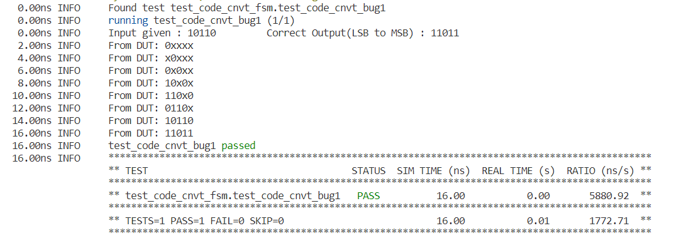

# Gray to Binary Code Converter using FSM Design Verification



## Verification Environment
The testbench drives inputs to the Design Under Test using dut.&lt;input-port-name&gt;.value = &lt;value&gt;

The values are assigned to the input port using 
```
inp = 20

dut.shift.value = 0
await RisingEdge(dut.clk)
dut.inp.value = inp
await RisingEdge(dut.clk)
dut.shift.value = 1
```
When shift is *HIGH*, the value on the D flip flops are shifted and fed to the FSM

The function *gray_to_bin(int) -> str* is used to convert the input number to gray for verification of the DUT, we take for granted that the function returns the correct gray to binary code conversion result


The assert statement is used for comparing the output from the Code Converter with the expected value. 
Here the output from DUT is LSB to MSB, hence we reverse the output from *gray_to_bin()*
```
out = gray_to_bin(inp).zfill(5)[::-1]

assert out == str(dut.out.value), f"Incorrect Operation\nExpected : {out} \t Got: {dut.out.value}"
```

## Bug


### Test Scenario 1
Input : 00111 
Expected Output : 10100
Output from DUT : 10110



- This shows that the S1 state output logic(the output after processing the MSB bit) is not correct



### Test Scenario 2
After fixing the above bug, 
Case 1:

Input : 10110
Expected Output : 11011
Output from DUT : 00011



Case 2: 

Input : 11001
Expected Output : 10001
Output from DUT : 00001



- This shows that the second last LSB bit of output is always zero



### Test Scenario 3
After fixing the above two bugs, and simulating against same input as in *Test Scenario 2*, 
Case 1:

Input : 10110
Expected Output : 11011
Output from DUT : 01011



- This shows that LSB bit is not 1 as expected, indicating some incorrect state transition for LSB bit




## Design Fix
Updating the design and re-running the test makes the test pass.



The updated design is checked in as main_corrected.v

## Verification Strategy
 Give few possible 5bit gray codes and check if the output is same as its binary equivalent. Check for the proper functioning bit by bit by changing inputs. The test scenario shows how inputs are changed to find bugs and fix them.

## Is the verification complete ?
 Verification is complete, as there is only 32 possible input vectors, verification is easy. For each gray coded input vector, we can check its equivalent binary code.